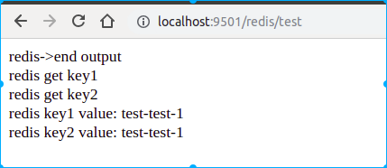
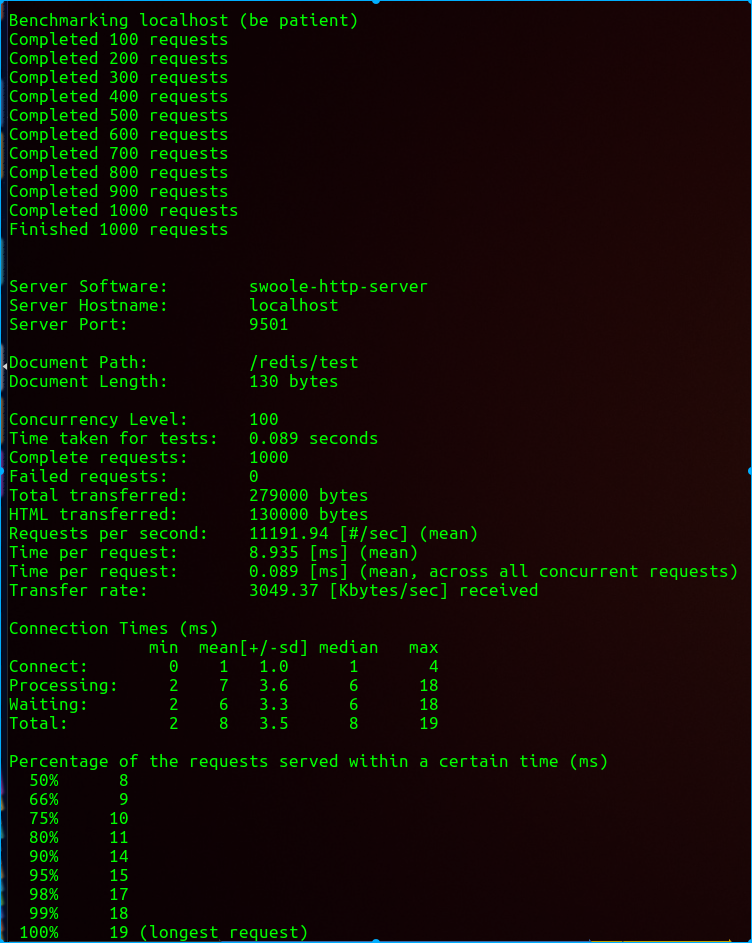

# dtsf
简单的基于swoole4协程开发的框架

### 安装
```php
git clone xxxxx
cd xxxxx
composer install
```


### 本地启动
```php
git clone xxxxx
cd xxxxx
composer install

bin/dtsf.sh start  开启
bin/dtsf.sh stop   停止
bin/dtsf.sh restart   重启
bin/dtsf.sh reload   重启worker
```

### 使用容器运行

#### 下载代码，初始化依赖
```php
git clone https://github.com/wjcgithub/dtsf.git
cd dtsf
composer install
```

#### 下载运行时容器（`打包运行环境，无需本地在配置`）

```php
docker pull wangjichao/dtsf_api
cd dtsf/docker
docker-compose up
```
- 如果不需要apollo配置中心支持可先注释docker-compose中的`apollo_config`配置

`测试:` 浏览器访问 http://localhost:9505/index

### 代码测试
Redis协程测试, 测试代码如下
```php
$chan = new \chan(2);
$result = '';
$redis = RedisDefaultDao::getInstance();
$redis->setex('key1', 300, 'test-test-1');
$redis->setex('ket2', 300, 'test-test-2');

$result .= "redis get key1<br>" . PHP_EOL;
\Dtsf\Coroutine\Coroutine::create(function () use ($redis, $chan){
    $val1 = $redis->get('key1');
    $s1 = "redis key1 value: {$val1}<br>" . PHP_EOL;
    $chan->push($s1);

});

$result .= "redis get key2<br>" . PHP_EOL;
\Dtsf\Coroutine\Coroutine::create(function () use ($redis, $chan){
    $val2 = $redis->get('key1');
    $s2 = "redis key2 value: {$val2}<br>" . PHP_EOL;
    $chan->push($s2);
});

for ($i=0; $i<2; $i++) {
    $result.=$chan->pop();
}

return "redis->end output <br> {$result}" . PHP_EOL;
```

上面代码已经在控制器中存在,直接访问 http://localhost:9501/redis/test即可看到如下输出


### 性能测试
` ab -n1000 -c100 localhost:9501/redis/test`
